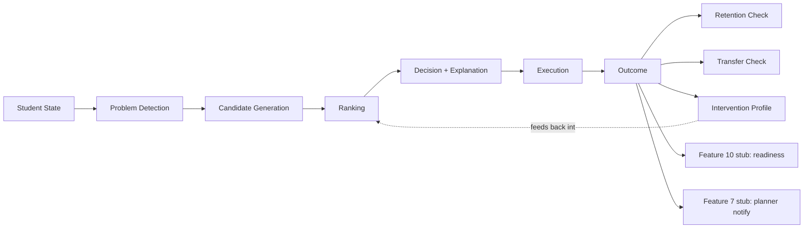

# ACEAPT Feature 12 — Personalized Intervention & Learning Transformation Engine

A working prototype of the intervention engine described in the Feature 12 brief:
**observe → identify the learning problem → generate candidates → rank →
select → explain → execute → measure → verify retention → update the
student's response profile.**

## Read this first: what's real vs. what's stubbed

The brief assumes an existing PrepVista/ACEAPT repository with Features 5 and
7–11 already built, and instructs (correctly) *"do not invent existing
features."* There was no repository in the workspace this was built in —
only the Feature 12 specification. So instead of fabricating a "codebase
discovery" report, this was built as a **standalone, integration-ready
engine**:

- Everything under `backend/src/engine/`, `backend/src/domain/`,
  `backend/src/api/`, and the whole `frontend/` app is a real, working
  implementation — not a mock.
- Features 5, 7, 8, 9, 10, 11 are represented in
  [`backend/src/integrations/stubs.ts`](backend/src/integrations/stubs.ts) as
  small interfaces with clearly-labelled placeholder implementations. The
  engine only ever depends on the interface, so swapping a placeholder for a
  real call into the actual service later requires **no changes anywhere
  else**.
- The one placeholder that does real work is the Feature 10 (readiness)
  stand-in — a simple recency-weighted average, explicitly commented as a
  heuristic, not a forecast model.
- Feature 5 (actual question delivery) doesn't exist yet either. The
  `InterventionRunner` screen in the frontend stands in for it: it presents
  the intervention (topic, duration, focus areas) and asks the demo user to
  report a result in the same shape Feature 5 would report it, so the rest
  of the pipeline (outcome measurement, profiling, readiness) has something
  real to work with.

Nothing about the SPEED_GAP → TIMED_DRILL demo story is hard-coded — it's
computed from raw seeded attempt data through the same code path a real
request would hit. See [Demo walkthrough](#demo-walkthrough) to verify this
yourself.

## What's implemented

Following the brief's own prioritisation (its "startup prototype priority"
section):

| # | Capability | Where |
|---|---|---|
| 1 | Problem detection (5 categories, evidence + confidence) | `engine/problemDetection.ts` |
| 2 | Candidate generation | `engine/candidateGeneration.ts` |
| 3 | Configurable ranking (problem/student/context fit, historical response, cost, load) | `engine/ranking.ts`, `config.ts` |
| 4 | Decision assembly (evidence + reason + confidence) | `engine/decision.ts` |
| 5 | 8 intervention types with real execution contracts | `domain/interventionCatalog.ts` |
| 6 | Execution lifecycle (start/complete/abandon) | `engine/execution.ts` |
| 7 | Before/immediate outcome + effectiveness classification | `engine/outcome.ts` |
| 8 | Retention check + effectiveness | `engine/outcome.ts`, `/retention-check` route |
| 9 | Transfer check + effectiveness | `engine/outcome.ts`, `/transfer-check` route |
| 10 | Personal intervention response profile (per type, evidence-based) | `engine/profile.ts` |
| 11 | Non-response detection | `engine/profile.ts` |
| 12 | Saturation detection | `engine/profile.ts` |
| 13 | Cold start handling | `engine/coldStart.ts` |
| 14 | Deterministic + optional-LLM explanation | `engine/explanation.ts` |
| 15 | Feature 10 (readiness) recalculation after outcome | `integrations/stubs.ts` |
| 16 | Feature 7/11 integration seams | `integrations/stubs.ts` |
| 17 | Event log (11 event types from the brief) | `events/eventBus.ts` |
| 18 | Per-student auth guard | `api/routes.ts` |
| 19 | Student UI: next intervention, why-this panel, runner, before/after, history, response profile | `frontend/src/` |
| 20 | Tests: unit (detection, ranking, outcome, cold start) + integration (full loop) | `backend/tests/` |

**Deliberately not implemented** (matches the brief's own "future" list —
building these without real usage data would mean guessing):
institutional/cohort analytics, content-friction signals, controlled
A/B experimentation, sequence-learning/RL, and a real auth system (see
[Security notes](#security-notes)).

## Architecture



```
aceapt-feature12/
├── backend/
│   ├── src/
│   │   ├── domain/          # types.ts (taxonomy), interventionCatalog.ts (execution contracts)
│   │   ├── config.ts        # every tunable threshold/weight — see "Tuning" below
│   │   ├── engine/          # problemDetection, candidateGeneration, ranking, decision,
│   │   │                    # execution, outcome, profile, coldStart, explanation
│   │   ├── integrations/    # honest stub adapters for Features 5, 7-11
│   │   ├── data/            # Repository interface + in-memory implementation + seed data
│   │   ├── events/          # event log
│   │   └── api/             # Express server + routes
│   └── tests/               # vitest — 21 tests, unit + integration
└── frontend/
    └── src/
        ├── components/      # NextInterventionCard, InterventionRunner, AfterInterventionSummary,
        │                    # InterventionHistoryList, ProfilePanel, StudentSwitcher, CalibrationMeter
        └── App.tsx           # orchestrates the OBSERVE → DECIDE → EXECUTE → MEASURE loop
```

## Setup

Requires Node 18+ (built and tested on Node 22). No database, no Docker, no
API keys needed to run it.

```bash
# Backend
cd backend
npm install
cp .env.example .env      # optional — every value has a safe default
npm run dev                # http://localhost:4000

# Frontend (separate terminal)
cd frontend
npm install
cp .env.example .env      # optional
npm run dev                # http://localhost:5173
```

Open `http://localhost:5173`. Two seeded students are available via the
switcher in the header — see [Demo walkthrough](#demo-walkthrough).

### Testing

```bash
cd backend
npm test          # 21 tests: problem detection, ranking, outcome, cold start, full loop
npm run typecheck
```

## Demo walkthrough

Two students are seeded from raw attempt data (`backend/src/data/seed.ts`),
not from hard-coded outcomes:

- **`student_102`** — Probability: 88% average untimed accuracy, 59% average
  timed/simulation accuracy, strong persistence. This reproduces the brief's
  own demo story: run it through the engine and it independently arrives at
  `SPEED_GAP → TIMED_DRILL`, confidence 0.82, baseline 59%.
- **`student_205`** — Percentages: ~48% accuracy in *both* timed and
  untimed modes, heavy hint use. Same subject, same rough score range as
  some of `student_102`'s attempts, completely different problem
  (`CONCEPT_GAP → CONCEPT_RETEACH`). This is the brief's own "same score ≠
  same intervention" principle, demonstrated with evidence rather than
  asserted in prose.

In the UI: pick a student → read **Why this?** (the evidence and confidence
that produced the pick) → **Start** → the runner shows a real countdown and
asks for a result (standing in for Feature 5) → **Finish & submit** → see
before/immediate/effectiveness → optionally **Simulate** a retention check →
**Continue** to see the response profile and history update.

Or hit the API directly:

```bash
curl -H "Authorization: Bearer student_102" \
  http://localhost:4000/api/students/student_102/next-intervention
```

## API reference

All routes are under `/api`, require an `Authorization: Bearer <studentId>`
header, and 403 if the token doesn't match the `:studentId` in the path.

| Method | Path | Purpose |
|---|---|---|
| GET | `/students/:id/next-intervention` | Run the full pipeline, return the top decision + explanation |
| POST | `/students/:id/interventions/:decisionId/start` | Begin executing a decision |
| POST | `/students/:id/interventions/:executionId/complete` | Report a result, compute outcome + update profile |
| POST | `/students/:id/interventions/:executionId/abandon` | Mark an execution abandoned |
| POST | `/students/:id/interventions/:executionId/retention-check` | Record a delayed accuracy check |
| POST | `/students/:id/interventions/:executionId/transfer-check` | Record familiar vs. novel-format accuracy |
| GET | `/students/:id/intervention-history` | Past executions + outcomes |
| GET | `/students/:id/intervention-profile` | Per-type response profile |
| GET | `/students/:id/state` | Debug/admin only — raw student state |
| GET | `/students/:id/events` | Debug/admin only — event log |

## Tuning the engine

Every threshold and weight lives in one file:
[`backend/src/config.ts`](backend/src/config.ts) — detection thresholds
(`ENGINE_CONFIG`), ranking weights (`RANKING_WEIGHTS`), how directly each
intervention type addresses each problem category
(`PROBLEM_INTERVENTION_FIT`), effectiveness thresholds
(`OUTCOME_THRESHOLDS`), and response-label thresholds
(`PROFILE_THRESHOLDS`). These are reasonable prototype defaults, **not
empirically validated** — the brief is explicit that real personalization
has to come from observed evidence over time, and this prototype has none
yet. Nothing in `engine/*.ts` hard-codes a number outside this file.

## Security notes

- Students can only read their own data — enforced in
  `api/routes.ts::requireOwnStudent`.
- The bearer token is currently just the student ID. **This is a prototype
  guard, not real authentication.** Replace it with whatever PrepVista's
  actual identity system is (session, JWT, OAuth) before this touches real
  student data.
- `GET /state` and `GET /events` are debug-only endpoints (explicitly called
  out in the brief, Section 64) — don't expose them to the student-facing
  client.

## Wiring this into the real PrepVista repository

1. Replace `data/inMemoryStore.ts` with an implementation of the
   `Repository` interface (`data/repository.ts`) backed by the real database.
2. Replace each stub in `integrations/stubs.ts` with a real call into the
   corresponding feature/service — the function signatures are the contract;
   nothing else in `engine/` or `api/routes.ts` needs to change.
3. Point `events/eventBus.ts::emit` at the existing event
   infrastructure instead of the in-memory log.
4. Swap the prototype auth guard for the real identity system.
5. If a design system already exists, swap the Tailwind tokens in
   `frontend/tailwind.config.js` for the existing ones and drop these
   components into it — the components themselves don't assume anything
   about the token values.
