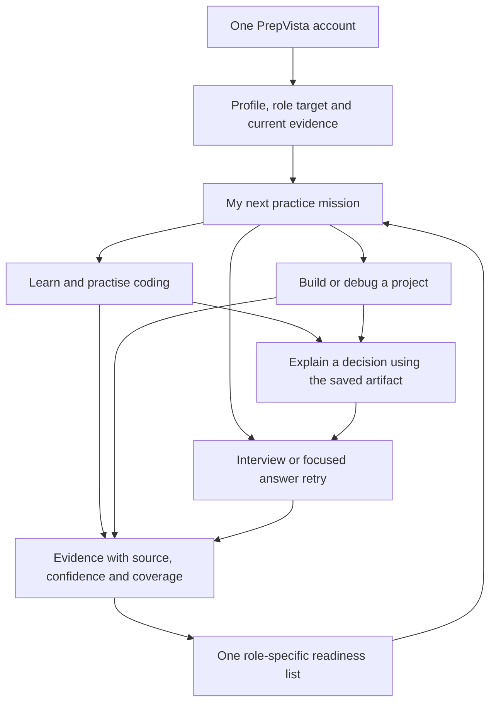
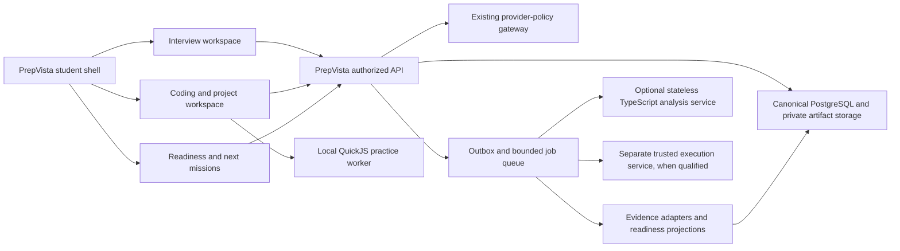

# PrepVista + CodeForge: safe unified-product integration plan

Implementation is underway. See the [current implementation and release record](UNIFIED_INTEGRATION_IMPLEMENTATION_STATUS.md)
for completed local work, verification and remaining qualification gates. This
document remains the proposed target; it is not a declaration of completion.

Status: proposed implementation plan, based on repository inspection on 2026-09-11.
This document authorizes no deployment and describes proposed behavior, not
features already integrated. This planning task changes documentation only.

Implementation started after this planning snapshot. See the
[first-slice delivery record](CODING_INTEGRATION_DELIVERY.md) for implemented
behavior, verification and remaining release gates; the target below is not a
claim that every phase is complete.

## 1. Recommended product decision

Build one PrepVista student product with Coding, Projects, Interview and Readiness
as connected workspaces. Reuse CodeForge's current learning UI, content and safe
domain engines where provenance permits. PrepVista owns the account, tenant
membership, entitlements, durable activity records, canonical evidence, readiness,
recommendations, reports and institutional permissions.

The target is one student experience with clear internal module boundaries.
One product does not require putting the coding runner, AI providers and database
into one process. Keep execution isolated and make a coding outage unable to
terminate an active interview.

Recommended launch order: unified authenticated practice first; trusted evidence
and readiness projection next; validated student readiness after shadow review;
institutional aggregates last. Do not make a score merge the first release.

## 2. Repository findings and reconciliation with earlier plans

| Inspected source | Current finding | Consequence |
| --- | --- | --- |
| `frontend/`, `app/` | PrepVista uses Next.js, FastAPI, Supabase auth and PostgreSQL | Reuse as the product authority |
| `app/services/interview_orchestrator.py`, `interview_v2_session.py` | V2 has bounded anchors, coverage and persisted text evidence | Add an adapter; preserve the live interview transaction |
| `CodeForge-AI/codeforge-unified/` | Current CodeForge is standalone Next.js, not the older Express composition described by the Phase 0 blueprint | Integrate from the current folder; treat older prototypes as reference material |
| CodeForge `package.json` | Node 24 requirement; Next 16.3.4 / React 19.2.4; PrepVista currently declares Next 16.3.3 / React 19.2.3 | Verify a compatible pinned build before porting components; do not combine lockfiles blindly |
| CodeForge `src/lib/state.tsx` | Anonymous `codeforge.workspace.v1` localStorage, at most 100 attempts, unscoped to an account | Explicit import and account-scoped sync are necessary |
| CodeForge `src/lib/progress.ts` | Maps client results to `studentId: 'local'`; independence derives from client assistance flags | Cannot become trusted institutional readiness without a new evidence boundary |
| CodeForge `src/runner/sandbox.ts` | JavaScript runs inside bounded QuickJS/WASM; no guest host bindings | Preserve for local practice; do not replace it with host-process execution |
| CodeForge `src/lib/adaptive.ts` | Tests, including locally marked hidden tests, and reference solutions reach the browser | Practice checks are public and cannot certify exam performance |
| CodeForge `src/app/api/mentor/route.ts`, `src/lib/security.ts` | Server Gemini access, origin checks, per-process shared rate limit; no PrepVista identity/quota | Move authorization/budget decisions to PrepVista before authenticated exposure |
| Both `next.config.ts` files | Coding denies microphone and permits WASM; interview needs microphone | Merge policy by route and capability; do not copy global headers |
| `app/services/placement_readiness.py` | Existing interview readiness includes heuristic company-probability concepts | Preserve historical contracts; exclude unvalidated probabilities from the unified view |
| `app/dependencies.py` | Canonical profile/auth and entitlement helpers; UserProfile does not carry a complete tenant scope | Resolve membership with existing organization services, not an invented JWT org field |
| Migration 029 / foundation V1 | Legacy institution and canonical organization naming coexist | Reconcile through an explicit mapping; never rename or join on assumptions |
| Migrations 036 and 037 | Already used for interview receipts/coaching | Older Phase 1B migration-036 draft must not be applied as numbered |
| `frontend/src/app/api/awake/route.ts` | Two rounds of three up-to-10-second probes, with delay; root 200 can satisfy fallback | Do not use this as a dependency readiness gate or extend it with synchronous fan-out |

Earlier documents remain historical design evidence:
`PREPVISTA_CODEFORGE_UNIFICATION_BLUEPRINT.md`,
`PREPVISTA_UNIFIED_FOUNDATION_V1.md`, `ADR-001-TECHNICAL-ENGINE-SIDECAR.md`,
`TECHNICAL_SERVICE_SECURITY_BOUNDARY.md`, `PHASE1B_IMPLEMENTATION_PLAN.md`.

Retain their single-authority, additive-migration, unknown-not-zero, outbox and
isolated-execution principles. This V2 proposal revises the old engine-only UI
scope to include the current coding workspace, subject to isolation and source
review. It does not adopt the older Node 20 requirement, old source paths or old
migration number. A TypeScript analysis sidecar remains conditional, not mandatory.

The earlier provenance report identifies unresolved ownership for an older
snapshot. The current copy manifest establishes local source tracking, not by
itself commercial ownership. Recheck the exact files proposed for reuse; obtain
ownership/license evidence where missing. Keep this a scoped reuse gate rather
than assuming all user-authored code is third-party or that every old finding
automatically applies to the new folder.

## 3. One student journey



1. Existing students sign in through their current account. New students select
   a role, department, preferred language and available practice time. Reuse
   existing resume/profile information with an editable preview.
2. The home page shows one next mission, why it was selected, expected effort,
   and a Continue action. Secondary work remains accessible without forcing a
   rigid coding-first sequence.
3. A mission can teach, practise, debug, build, explain, interview or retry.
   Prerequisites and entitlements are checked before showing its launch action.
4. Coding artifacts can support a bounded project-defense interview. For example,
   a student implements caching, tests it, then explains invalidation and trade-offs.
   The interviewer receives an authorized artifact excerpt and known evidence gaps.
5. After completion, show what changed, which observations support it, what is
   still missing and the next useful mission. A fluent explanation cannot erase
   failed correctness checks; passing tests cannot establish communication skill.
6. A returning student resumes the exact draft/mission across devices. Their
   readiness view identifies stale or incomplete evidence instead of resetting it.

Preserve `/dashboard` and `/student-dashboard` as compatible entries backed by
shared journey components. An organization assignment is visibly distinct from
self-practice. Organization membership must not silently replace personal goals,
credits, privacy choices or history rights.

Guest practice may remain in the standalone product during transition. Clearly
label it local and unsynced, with an explicit path to save into an account. It
must not call paid authenticated services or write verified readiness anonymously.

## 4. Target architecture and ownership



| Concern | Sole authority | Reuse/extension |
| --- | --- | --- |
| Identity | Supabase identity + PrepVista profile mapping | No CodeForge account table or email-based account merging |
| Tenant visibility | Existing organization membership/permissions | Resolve per request and per resource |
| Billing and quotas | PrepVista entitlement and usage services | New feature allowances without changing existing interview counts |
| Public application | Existing PrepVista frontend | Port reviewed CodeForge screens as route-scoped modules |
| Drafts/artifacts | PrepVista persistence and private storage | Local autosave cache and explicit guest import |
| Coding results | Domain assessment service | Local practice observations remain client-reported |
| Interview flow | Existing V2 orchestrator and legacy compatibility path | Bounded artifact-context adapter |
| AI policy | Existing PrepVista provider registry, extended through adapters | Preserve Gemini capability where configured; no second quota authority |
| Evidence/readiness | New canonical evidence and projection services in PrepVista | Neither legacy numeric score becomes the other domain's score |
| Student reports | Versioned PrepVista report snapshots | Original module reports remain accessible |
| Student code execution | Browser VM for practice; separate qualified runner for trusted tests | Never FastAPI, Next.js, analysis sidecar or database host |

Target paths, preserving current redirects:

| Current CodeForge path | Proposed PrepVista destination |
| --- | --- |
| `/`, `/progress` | Shared dashboard and `/readiness` |
| `/learn`, `/diagnostic` | `/coding/learn`, `/coding/diagnostic` |
| `/practice`, `/practice/[id]` | `/coding/practice`, `/coding/practice/[id]` |
| `/debug`, `/incidents` | `/coding/debug`, `/coding/incidents` |
| `/projects` | `/coding/projects`, connected to shared artifacts |
| `/interview` | `/coding/explain` for technical explanation exercises; full interview remains `/interview/*` |
| `/settings` | Shared account settings plus `/coding/settings` preferences/import/export |
| `/api/mentor`, `/api/review` | Authenticated, namespaced coding API through PrepVista |

Port one vertical slice into `frontend` before moving other screens. Use a
bounded module directory and shared contract package; scope styles, providers,
worker URLs and asset names. Remove the duplicate coding shell only after its
navigation, theme and accessibility are preserved in the shared shell.

If the component port proves too risky, a temporary same-domain Next.js zone is
an alternative behind a flag, not a default requirement. It needs unique asset
paths, routing tests and full navigations across zones. Do not use an iframe as
the primary product integration. Next.js documents the separate route/asset
ownership required for zones. [Next.js multi-zones](https://nextjs.org/docs/app/guides/multi-zones)

## 5. One readiness list, with evidence that remains distinguishable

Use one role-specific preparation view and one calculation authority. Retain
coding, interview and project evidence as separate observations. Do not average
CodeForge's mastery percentage with PrepVista's interview score.

Initial domains retain the foundation's `technical`, `reasoning`, `communication`
and `interview` taxonomy. The student list groups capabilities into readable rows:

| Readiness row | Relevant evidence | Must not infer |
| --- | --- | --- |
| Problem understanding and reasoning | Approach, constraints, edge cases, decisions | Correctness solely from a convincing explanation |
| Programming and correctness | Supported-language test results with declared authority | Untested languages or unseen behavior are correct |
| Debugging and validation | Reproduction, hypothesis, change, regression evidence | Trying random fixes establishes a reliable process |
| Project ownership and decisions | Artifact versions, contribution explanation, testing, trade-offs | Possessing a file proves authorship |
| Communication and explanation | Relevant, structured answer evidence and supported delivery measures | Accent, grammar alone, disability or personality determines capability |
| Interview judgment and role fit | Behavioral examples, role reasoning, bounded follow-up evidence | Hiring probability or company-specific certainty |

Each row contains: state, evidence coverage, confidence, source/authority labels,
latest assessment date, supporting evidence links, unresolved gaps and one next
action. Readiness is keyed by target role and policy version; preserve snapshots
when a student changes their target.

Proposed row states: `NOT_MEASURED`, `INSUFFICIENT_EVIDENCE`, `DEVELOPING`,
`DEMONSTRATED_IN_PRACTICE`, `REVIEW_NEEDED`. Use a separate freshness/data-health
label (`CURRENT`, `STALE`, `PENDING`, `UNAVAILABLE`) rather than treating system
failure as weak student performance.

Overall preparation state is a non-compensatory summary:

1. Missing adequate evidence for a required capability means **More evidence
   needed**, regardless of high scores elsewhere.
2. Adequate evidence with an observed unresolved gap means **Developing**.
3. Conflicting credible observations mean **Review needed**, with the conflicting
   evidence shown; do not accuse the student of dishonesty.
4. Only when every required capability meets its approved evidence gate may the
   summary say **Demonstrated in practice for this role**. This is not placement
   prediction, certification or proof of unaided performance.

The initial product need not expose a global number. If a numeric index is later
required, keep coverage, confidence, critical-capability floors and provenance
visible; qualify the model in shadow first. No raw legacy-score average.

### Evidence authority and qualification

| Source | Permitted use |
| --- | --- |
| Guest import or browser-reported pass | Practice history and suggestions; not trusted test verification |
| Authenticated client report | Attributed submission receipt; execution result still client-reported |
| Validated isolated-server test | Evidence of the submitted artifact against the declared test suite |
| AI/static analysis | Advisory or rubric evidence with source/limitations; not blanket correctness |
| V2 textual interview evidence | Early signals and gaps; retain current limited confidence |
| Qualified rubric/human review | Evidence within declared reviewer/rubric scope, with audit trail |

A signed receipt proves receipt/authentication, not that the browser executed a
test honestly. A server test proves covered behavior, not authorship, independence,
Big-O complexity or comprehensive correctness. Unknown assistance remains
`UNKNOWN`, never silently `INDEPENDENT`.

Publish a versioned evidence policy specifying eligible sources, task-family
diversity, freshness, comparability, reviewer agreement and any minimum sample
requirements for each capability. Candidate thresholds are hypotheses until
validated. The existing V2 heuristics alone cannot justify high-confidence global
readiness. Qualification needs reviewed rubric examples and, where applicable,
trusted execution. High-stakes selection use is outside the first release.

### Calculation pipeline

`domain completion -> transactional outbox -> validated adapter -> canonical
evidence -> capability projection -> readiness snapshot -> next mission`.

For each calculation: resolve target-role policy, deduplicate observations,
exclude unavailable/unsupported measurements, retain original source authority,
group correlated observations, assess required-capability coverage, flag
contradictions, calculate qualified row states, then derive the overall state.
Store input IDs, source versions, policy version and processing watermark.
Replaying identical inputs must reproduce the same result.

Do not count interview follow-ups as independent demonstrations of the same
anchor. Do not count the same code, project, retest or imported attempt twice.
Repetition may demonstrate practice persistence while transfer remains unmeasured.

## 6. One recommendation loop

One coordinator resolves competing coding/interview recommendations. Filter by
permissions, supported language, available service, prerequisites and time before
ranking. Prioritize observed important gaps and missing required coverage; avoid
locking a student into repeated work on one capability.

Examples:

- Correctness fails but explanation is clear: coding/debugging mission.
- Tests pass but ownership evidence is thin: explain an actual decision, then a
  short project-defense interview.
- Ownership is explicit but improvement has no measurement: gather a real
  before/after test, then retry that answer.
- Evidence exists only for JavaScript but target is Python: show the language
  coverage gap and a supported next step, not a converted proficiency score.
- Provider is down: authored practice or saved review, not a failed assessment.
- A capability is not measured: discovery activity; do not call it a weakness.

Every mission stores origin evidence, objective, accepted completion criteria,
estimated duration, activity link, entitlement requirement and recommendation
policy version. Completion must follow committed activity evidence, not a click.
Students can skip, defer or change focus with an explanation recorded for future
recommendations. No recommendation should launch an endless follow-up chain.

## 7. Proposed canonical contracts and additive storage

Reuse existing profile, organization, auth, entitlement, interview, retry and story
tables. A generic activity record references a module's source record; it does not
replace the interview session model.

Proposed concepts, to reconcile against existing schema before DDL:

- `capability_definition`, `capability_edge`, `role_capability_policy`.
- `activity_session`, `coding_attempt`, `artifact_version`, `draft_revision`.
- `evidence_event`, `evidence_source_link`, `processing_outbox`.
- `capability_projection`, `readiness_snapshot_v2`, `report_snapshot`.
- `practice_mission`, `mission_activity_link`, `guest_import_batch`.
- Existing usage events extended with reservations/settlement where required.

Example evidence envelope:

```json
{
  "schema_version": 1,
  "evidence_id": "server-issued-id",
  "student_profile_id": "resolved-by-server",
  "organization_scope_id": null,
  "source_module": "coding",
  "source_record_id": "attempt-id",
  "source_revision": 1,
  "source_event_id": "unique-domain-event",
  "activity_id": "shared-activity-id",
  "capability_key": "technical.correctness",
  "capability_version": 1,
  "observation": "practice_checks_completed",
  "authority": "CLIENT_REPORTED",
  "assistance": "UNKNOWN",
  "language": "javascript",
  "challenge_version": "declared-version",
  "artifact_ref": "private-object-reference",
  "rubric_version": "declared-version",
  "observed_at": "client-time-with-untrusted-time-marker",
  "received_at": "server-time",
  "availability": "AVAILABLE"
}
```

The API derives identity/scope and authority. Clients cannot set those trusted
properties. Raw code/transcripts live behind private references, not in ordinary
telemetry or unrestricted event payloads. A personal artifact is not automatically
an institution-owned artifact; visibility is a separate policy.

Proposed endpoints (all versioned, bounded and owner-scoped; paths below are
relative to the existing backend API base, not new competing frontend routes):

| API | Contract |
| --- | --- |
| `GET /journey/current` | Current target, next mission, active work, projection freshness |
| `GET /readiness/current?role_id=...` | Authorized immutable snapshot reference and rows |
| `GET /readiness/snapshots/{id}` | The same snapshot used by the report |
| `POST /coding/attempts` | Server-owned activity/attempt ID and authorized work limits |
| `POST /coding/attempts/{id}/observations` | Idempotent practice observation; never accepts trusted pass claims |
| `POST /coding/attempts/{id}/validate` | Conditional trusted-run job; entitlement reservation required |
| `PUT /coding/drafts/{id}` | Revision/ETag-based update; conflict returns both recoverable versions |
| `POST /coding/imports/preview` | Validated bounded import preview; no readiness mutation |
| `POST /coding/imports/{id}/commit` | User-confirmed import with stable manifest/idempotency key |
| `POST /missions/{id}/launch` | Rechecks access and resumes or creates the correct activity |
| Existing interview setup/answer/finish | Add optional authorized mission/artifact context; preserve contracts |

Use uniqueness on canonical source-event/revision identity, replay-safe command
keys, optimistic draft revisions and per-aggregate sequence numbers. Design for
at-least-once events with idempotent effects; do not promise exactly-once delivery.
Dual-write only the domain result and outbox in the same database transaction.
Do not require an HTTP call to another service to commit an interview answer.

## 8. Identity, tenancy, credits and AI

Reuse the existing verified auth path and profile mapping. Never use an email,
client `studentId`, submitted organization ID or editable user metadata as an
authorization decision. Tokens need verified issuer, audience, signature and
expiry using the deployed auth configuration. Privileged endpoints also resolve
current membership/entitlements. Supabase documents JWT verification and RLS;
application authorization remains necessary, including when service/database
roles bypass browser RLS. [JWT verification](https://supabase.com/docs/guides/auth/jwts),
[RLS](https://supabase.com/docs/guides/database/postgres/row-level-security)

The first authenticated coding slice reuses current PrepVista credential handling;
do not redesign all authentication at the same time. Any later HttpOnly-cookie/BFF
migration needs its own CSRF, refresh, logout, account-switch and WebSocket tests.
Never pass tokens in query parameters, deep links or local-storage import files.

Maintain separate entitlements for interview sessions, coding practice, trusted
execution and AI mentoring. A unified product may show one billing page while
retaining distinct allowances and sponsored organization grants. Existing paid
interview allowances must remain unchanged until an explicit commercial decision.
Coding usage must not decrement interview counts. Check access server-side on
every paid action, not only when rendering buttons.

For metered operations, reserve quota atomically, settle one committed result,
release eligible failed reservations and reconcile orphaned jobs. Specify who
pays when personal and organization grants coexist. Grandfathering, free access,
prices and limits are decisions to settle before enabling a commercial rollout.

Route AI through one policy/budget layer. Introduce a Gemini adapter if needed
rather than discarding CodeForge's working provider capability. Keep model
selection, per-user/tenant limits, fallback behavior and cost telemetry explicit.
Shared limits must work across instances. Prompt context is allowlisted and
minimized; do not send a full resume with every code hint. Code, transcripts and
model output remain untrusted, with no arbitrary tool/network authority.

## 9. Guest data and historical migration

Browser storage belongs to its origin, not the signed-in account. Moving paths
within an origin does not isolate it; moving to another origin does not move it.
Use an explicit export/import or tightly scoped migration page at the original
origin. [MDN localStorage](https://developer.mozilla.org/en-US/docs/Web/API/Window/localStorage)

Guest import sequence:

1. Preserve an original export before conversion. Offer migration without
   removing the original data or silently claiming it for the current user.
2. Validate size/schema/version and preview selected drafts, notes and attempts.
   Explain that a shared browser may contain another person's work.
3. Record the student's explicit selection/ownership declaration. Assign new
   server IDs; keep imported IDs only as source references.
4. Commit in bounded idempotent batches with a manifest hash, counts and per-item
   disposition. Retries must not import an attempt twice.
5. Import practice outcomes as client-reported historical observations, preserving
   uncertain dates and assistance. Never promote old local mastery to verified.
6. Keep local backups until reconciliation succeeds. Offer export and a scoped
   discard option; do not clear all localStorage or unrelated PrepVista settings.

Authenticated drafts use a profile-scoped cache with account-switch invalidation.
Offline queues carry the original account scope and must never be replayed under
a different user's session. Logout revokes credentials and clears sensitive
in-memory state; offer a deliberate draft backup when needed on a shared machine.

For interview backfill, retain original records and policies. Emit one canonical
observation per stable source/revision and qualify legacy versus V2 semantics.
Follow-ups retain anchor links. Scan active sessions only after a committed domain
event; do not backfill provisional answers into final readiness.

Allocate migration numbers only after checking the actual migration ledger. The
current repository has 036 and 037; the next available number may be 038, but
must be rechecked when implementation starts. Never apply the older draft as 036.

Use expand/backfill/reconcile/read-switch/contract. Maintain checkpoints, bounded
transactions, lock budgets, conflict quarantine and count/hash reconciliation.
Destructive cleanup is a separate later release after source and restore checks.

## 10. Execution, resilience and health

Keep local QuickJS practice functional during initial integration. Preserve input,
output, stack, memory and wall-clock limits; test cancellation, infinite loops,
large returns, worker crashes and unavailable WASM. Do not grant guest code DOM,
network, filesystem, process or application-token bindings.

Trusted assessment is a separate gated workstream: isolated runner/provider,
ephemeral filesystem, deny-by-default network, no application secrets, bounded
CPU/memory/output/concurrency, immutable images, versioned challenge tests and
authenticated single-use job/result references. The analysis sidecar only
calculates over validated inputs; it does not execute submissions. Introduce
additional languages only after their runner and rubric support pass independently.

Preserve module availability boundaries: interview can proceed if coding analysis
fails; authored coding practice can proceed if mentoring fails; readiness can show
its last snapshot with age and pending state if projection processing is delayed.

Keep health terminology separate from student readiness. Liveness checks whether
a process is alive; dependency readiness checks required resources. The active
`/api/awake` route is currently a frontend heartbeat with backend details, not a
reliable all-services gate. Its six sequential probe timeouts can approach 61.5
seconds before overhead. Proposed correction: one bounded cached/coalesced probe,
explicit critical/optional dependency statuses, no success inferred from backend
root HTML, and no public endpoint accepting arbitrary probe targets. Preserve its
response compatibility during the change. Avoid periodic per-student fan-out.

## 11. Delivery phases and acceptance gates

| Phase | Concrete deliverable | Required gate | Reversible fallback |
| --- | --- | --- | --- |
| 0: Baseline | Source/provenance review; current feature inventory; both applications' test/build baselines; route and database map | Known source set, current migration ledger, repeatable tests; unresolved reuse files isolated | No runtime change |
| 1: Contracts | Canonical capability/evidence/mission contracts; role mapping; auth/entitlement ownership; flags default off | Schema compatibility, unknown-not-zero and tenant adversarial tests | Unused contracts only |
| 2: One coding slice | Authenticated coding catalog → editor → local worker → result within PrepVista shell | No auth/voice/CSS/asset regression; unsupported execution honest; original coding features inventoried | Disable coding route flag; retain standalone route |
| 3: Persistence/import | Server drafts, local recovery, idempotent attempts, explicit guest import and metering | Two-account/two-device tests; import reconciliation; no silent data loss or changed interview credit counts | Disable new imports; preserve committed server drafts/export |
| 4: Evidence bridge | Transactional interview/coding outbox; adapters; canonical ledger; replay worker | Duplicate/out-of-order/crash/replay tests; source-to-ledger reconciliation; no live interview latency dependency | Pause consumer; keep durable events for replay |
| 5: Qualified evidence | Trusted runner where required; reviewed interview/code rubrics; provenance/assistance policy | Security qualification and declared measurement limits; no browser trust upgrade | Continue practice-only evidence; block high-confidence classification |
| 6: Shadow readiness | Role-specific capability rows, immutable snapshots and next-mission proposals | Reproducibility, reviewed fixtures, subgroup/coverage analysis, explanation audit; no user score overwrite | Keep old views authoritative; hide shadow results |
| 7: Student pilot | One journey home, readiness list and coding → explanation → interview → repair loop | End-to-end user acceptance, availability/cost budgets and zero isolation defects | Return to stable dashboard; preserve imported work and history |
| 8: Institutional pilot | Same snapshot authority, authorized cohort aggregates and assignment links | Membership tests, small-cohort suppression, privacy/access audit and no hiring claims | Disable new cohort views independently |
| 9: Gradual cutover | All reviewed coding screens moved; redirects and support runbooks; obsolete authority paths retired | Sustained pilot metrics, restore drill, complete feature-preservation checklist | Route/consumer rollback while keeping authoritative writes |

Phases describe dependencies, not a calendar promise. Estimate only after the
baseline and trusted-runner decision. Practice-only unification can ship before
readiness qualification, but must be labeled incomplete rather than presented as
verified placement readiness.

Suggested bounded PRs: contracts; entitlement adapter; coding-shell slice; draft
sync; guest import; AI adapter; outbox; interview evidence adapter; coding evidence
adapter; shadow projection; mission coordinator; report snapshot; student pilot;
organization aggregates; redirects/retirement. Keep dependency upgrades, auth
transport changes, code execution and destructive migrations separate.

Implementation touchpoints:

- `frontend/src/app/coding/**` and a scoped coding component module.
- Shared journey/readiness components reused by both existing dashboard routes.
- `frontend/src/lib/api.ts` additions and account-aware draft client.
- CodeForge `state.tsx` replacement adapter; preserve schema decoder for import.
- Existing provider registry plus capability-specific Gemini integration.
- New FastAPI coding/evidence/readiness/mission modules behind existing auth.
- Existing interview finish persistence/outbox adapter, avoiding a synchronous
  dependency on coding readiness.
- Additive numbered SQL and separate projection/backfill workers.
- Health route changes independently reviewed against current consumers.

## 12. Validation, rollout and rollback

Re-run both applications' baselines during implementation; prior pass counts are
historical evidence, not proof that integration passes. Required suites include:

- API schemas, adapters, capability mappings, version compatibility and replay.
- Real PostgreSQL migrations/RLS/constraints and application-role authorization.
- Two users, two organizations, personal plus sponsored grants and revoked access.
- Login/logout/refresh, account switch, offline replay and multi-tab/multi-device
  drafts; login-required routes must not reveal another account's cached content.
- Coding memory/CPU/output abuse, secret exfiltration and worker termination.
- Missing language/provider/STT data remaining unavailable, not zero.
- Full interview voice and transcript flows, answer/finish retries and reports.
- Browser import on same/different origins, old formats, corrupt payloads and
  duplicate commits without deleting the original export.
- Readiness golden cases: missing required capability, contradictory evidence,
  repeated challenge, assistance unknown, outdated policy, role change and late
  results. The same snapshot must drive student and permitted institution views.
- Mobile/keyboard/screen reader/zoom and representative slow devices/networks.
- Payment failure, quota concurrency, retry settlement and sponsored-plan expiry.
- Restore, rollback, delayed/out-of-order events, object deletion and replay after
  deletion. Deletion tombstones must prevent resurrection from a queued event.

Use independent default-off flags: `CODING_WORKSPACE_ENABLED`,
`CODING_SERVER_SYNC_ENABLED`, `CODING_GUEST_IMPORT_ENABLED`,
`CODING_TRUSTED_VALIDATION_ENABLED`, `UNIFIED_EVIDENCE_ENABLED`,
`UNIFIED_READINESS_SHADOW`, `UNIFIED_READINESS_VISIBLE`,
`UNIFIED_MISSIONS_ENABLED`, `UNIFIED_TPO_VISIBLE`.
Assignment is server-controlled, sticky per session and auditable.

Roll out internal → opt-in students → bounded organization cohort → staged wider
release. Example 1%/5%/25% ramps are proposed operating choices, not automatic
approval. At each gate require product, backend, security, assessment and
operations sign-off for their responsibilities.

Hard stop: any cross-user/tenant disclosure, unauthorized charge, unsafe host
execution, lost acknowledged artifact, client-forged trusted evidence, unknown
converted to weak/zero, unreproducible snapshot or missed deletion boundary.

Proposed performance/cost gates, to validate against measured baselines: no more
than 10% p95 regression on existing interview requests; no synchronous projection
dependency; readiness freshness within an agreed SLO (initial target 60 seconds
outside a declared backlog); no duplicate charge/evidence in replay tests; actual
mentor/execution spend within a configured daily budget. Track denominator,
sample size and error types rather than presenting small samples as proof.

Rollback changes routing/visibility/consumers, not history. Once server sync is
authoritative, never silently roll users back to an old anonymous local store.
Keep a compatible read/export path and recoverable draft writes. Pause outbox
consumers without discarding events; rerun versioned projections after repair.
Reverting an app release must support the expanded schema. Data-loss recovery
uses a rehearsed restore/reconciliation procedure, not an automatic down migration.

## 13. Decisions required before relevant release gates

| Decision | Safe planning default |
| --- | --- |
| Product brand | PrepVista; Coding is a workspace, CodeForge may remain its internal module name |
| Guest continuity | Preserve standalone guest practice during transition; import only with explicit selection |
| Coding and mentor pricing | No change to existing interview entitlements; new paid grants remain disabled until defined |
| Verification | Browser practice first; no verified-readiness promotion until qualified evidence exists |
| Initial roles/languages | Select a narrow supported launch set; show all other coverage limits honestly |
| Retention and institutional visibility | Reconcile actual product contracts and existing policy; no invented retention duration or automatic transcript sharing |
| Hosting | Preserve current deployment while porting modules; sidecar/runner only when justified and operated |
| Source reuse | Review exact current files and dependency notices; isolate unresolved materials |

None of these open commercial/governance decisions prevents completing the safe
technical plan. They are prerequisites for the affected implementation or release,
not permission requests to do this planning work.

## 14. Risk register and completion definition

The companion [integration risk register](PREPVISTA_CODEFORGE_INTEGRATION_RISKS_V2.md) enumerates 64 risks,
controls, responsible roles and closure tests. They are identified risks, not a
claim that every unknown future risk has been eliminated. A control is a proposed
solution until its closure test and operational ownership are demonstrated.

Integration is complete when a student uses one account to resume coding work,
understand its result, explain the actual artifact in PrepVista's interview flow,
receive one qualified readiness list and continue one next mission; personal and
organization permissions remain correct; all original supported features have
an accessible destination; and rollback preserves their data and entitlements.
Do not declare completion merely because both products share a logo or URL.

Object-level access controls are a required validation focus for this design,
consistent with [OWASP's API object-authorization guidance](https://owasp.org/API-Security/editions/2023/en/0xa1-broken-object-level-authorization/).
